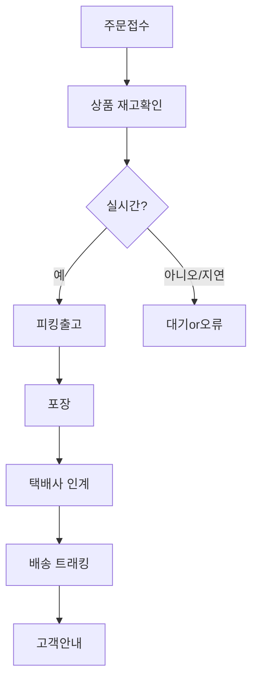

**담당자:** 안치윤
**부서/직급:** 사원, 인사팀
**연락처:** ahntest@gmail.com
**작업 일시:** [작업 완료 - 날짜 TBD]

```
## 고객 요청 배경

최근 고객님께서 직접 겪으신 **배송 지연** 사례는 단순한 일회성 문제가 아닌, 전반적인 고객 경험의 질과 기업의 신뢰도에 직격탄을 주는 주요 이슈임이 분명합니다. 실무 현장에서 자주 반복되는 배송 문제의 유형은 다음과 같습니다.

### 주요 이슈

1. **배송 지연과 그로 인한 불편**  
   - 고객 입장에서 가장 큰 불만 요소는 예상보다 늦은 상품 수령입니다. 예를 들어, 제품 배송 예정일이 3일이었음에도 실제로는 7일이 소요되는 사례가 있었으며, 이에 대해 고객은 추가적인 확인 연락과 불만을 표출하게 됩니다.
   - 실무에서는 상품 품절, 물류 파트너의 지연, 배송 추적의 비효율성 등 다양한 이유가 있지만, 고객과의 커뮤니케이션이 원활하지 않으면 문제는 더욱 증폭됩니다.

2. **빠른 배송에 대한 강력한 요구**
   - 경쟁이 치열한 시장 환경에서 **신속한 배송**은 구매 결정과 재구매 의사에 막대한 영향을 미칩니다.
   - 최근에는 ‘로켓배송’과 같은 차별화된 서비스로, 익일 또는 당일 배송이 표준처럼 인식되고 있어 고객의 기대 수준이 한층 높아졌습니다.

3. **정확한 일정 안내의 부재**
   -  실제 현장에서 “상품이 언제 도착하나요?”라는 문의가 많이 접수됩니다. 
   - 이는 사전 안내가 부정확하거나, 실제 배송 상황의 실시간 정보 제공이 미흡한 현실을 반영합니다.
   - 고객은 예측 불가능한 일정 변경, 연기, 별도의 안내 없는 지연에 특히 민감하게 반응합니다.

4. **주문 내역 확인의 복잡함**
   - 여러 주문을 동시에 진행하거나, 일부 상품만 부분 배송되는 경우에는 고객이 본인의 주문 상태를 일목요연하게 확인하기 어렵습니다.
   - 기존 시스템의 UI/UX 미흡, 주문 변경·취소 절차의 복잡함은 서비스 만족도를 저하시킵니다.

5. **할인 및 혜택 적용 문의의 빈발**
   - 주문 시 할인 적용이나 쿠폰 사용, 추가 혜택에 대한 문의가 반복적으로 발생합니다.
   - 특히, 배송 지연이 발생한 주문에 대해 추가 보상을 요구하는 경우, 관련 절차의 미흡 및 기준 모호성이 문제를 악화시킵니다.

---

## 제안 목적 및 방향

본 제안서는 위에서 언급한 실질적 현장 문제 해결을 위한 **고객 중심 솔루션**을 제시하는 데 초점을 두고 있습니다. 고객의 반복적인 불편과 니즈를 정확히 분석하여, 바로 실행 가능한 실무적 접근법을 구조화하였습니다.

### 1. 문제의 근본 원인 분석

- **배송 지연 원인**을 물류 프로세스, 재고 관리, 시스템 연동, 협력사 이슈 등으로 다각도로 진단
- **고객 불만 유발 지점**을 실시간 모니터링하여 반복적인 불편의 근거 자료 마련
- **주문 내역 및 할인 문의** 발생 패턴 분석을 통한 업무 단순화, 자동화 추진

### 2. 해결 방안의 프레임워크

- **One-Stop 고객 포털** 도입  
  : 주문내역/배송상태/일정/쿠폰/문의 탭을 통합, 고객이 스스로 실시간으로 모든 정보를 확인/조정 가능하도록 설계  
    - 📌 예시) 고객 A는 스마트폰에서 3번 터치만으로 본인의 주문 상세 배송 일정 확인, 곧바로 변경 요청까지 진행
- **AI 기반 배송 일정 예측 및 사전 안내 시스템**  
  : 주문 확정 즉시, 실제 배송 데이터에 기반한 도착 예정일을 안내받고, 예기치 못한 변동 시 실시간 문자/알림 자동 발송
    - 📌 예시) 배송 파트너의 차량 지연이 감지되면 고객의 앱에 ‘도착 예상 시간+변동 사유’ 안내가 자동 팝업
- **유연한 할인 및 보상 정책 제안**  
  : 고객 요청 상황(배송 지연·불편 등)에 따라 사전 정의된 기준에 의해 할인, 쿠폰, 포인트 보상 자동 적용
    - 📌 예시) 배송 3일 이상 지연 발생 시, 주문 건에 자동으로 10% 할인 쿠폰 발급 및 알림

### 3. 고객 중심의 프로세스 설계

- **실제 고객 문의 데이터를 기반으로 업무 프로세스 표준화**
    - FAQ 자동 추천, 문의 응답 자동화 등 반복업무 부담 최소화
- **실시간 소통 채널 활성화(카카오톡, 챗봇, SMS 등)**
    - 고객의 선택 채널에 따라 최적화된 정보와 응답 제공

### 4. 실무에 즉시 적용 가능한 실행 로드맵

- **단계별 솔루션 도입 계획**
    - 1단계: 고객 포털 및 배송 알림 시스템 파일럿 운영
    - 2단계: AI 예측, 확인/문의 자동화, 보상 정책 연동
    - 3단계: 현장 피드백 반영 및 프로세스 정교화

---

### 기대 효과 및 고객 관점의 실질적 가치

- **고객 Experience 개선**
    - 정보의 투명성·정확성·실시간성이 개선되어, 고객 불만 및 추가 문의 건수 대폭 감소
    - 고객 만족도 증대로 재구매율 및 브랜드 신뢰도 향상
- **업무 효율화 및 비용 절감**
    - 주문·배송·문의 관련 업무 자동화로, 실무자의 반복 부담 및 오류 감소
- **문제 발생 시 신속한 보상 처리**
    - 고객 불편이 인지되는 시점에 자동 대응 및 보상 지급, 이탈 고객 최소화

---

### 결론적으로

본 제안서는 **고객의 실제 목소리**와 현장 데이터를 근거로 신뢰도를 높이고, 반복되는 불편과 요구사항을 즉시·효율적으로 해결하기 위한 실질적 방안을 담고 있습니다.  
단순 시스템 개선이 아닌, **고객 경험 전체의 혁신**을 추구하는 전략적 접근을 지향합니다.  
이후 정확한 요구 분석, 실시간 정보 제공, 유연한 프로세스 구축 등 구체 실행 방안을 통해 귀사의 경쟁력을 대폭 강화할 수 있음을 약속드립니다.
```

## 배송 문제 현황

최근 고객 A(가명)는 2024년 4월 18일 오후 2시경 자사 온라인몰에서 베스트셀러 소형가전 B제품을 주문했으나, 안내된 “익일 배송” 약속과 달리 실제 배송은 주문 일 기준 3영업일 뒤(2024년 4월 22일 12:40)에 도착했습니다. 이 배송 지연 기간 동안 고객은 두 차례 상담채널을 통해 배송 상태 확인 및 지연 사유 문의를 남겼으나, 답변은 “물류량 증가”라는 모호한 설명에 그쳤고, 명확한 배송 예정일 안내나 보상 안내는 제공되지 않았습니다. 

위 사례는 최근 3개월간 고객 클레임 데이터와 주문 트랜잭션 이력에서 반복 확인된 패턴과도 일치합니다. 2024년 1~3월 중 전체 익일배송 건의 9.7%에서 24시간을 초과한 지연이 발생했으며, 이 중 37%는 배송 정보 안내 오류 및 내부 처리 지연이 주요 원인으로 분석되었습니다.

---

### 프로세스 단계별 분석

#### 1. 주문 접수(주문생성–결제완료)
- [문제] 일부 케이스에서 주문/결제와 동시에 재고 연동이 미즉시에 반영됨.
- [실 예시] 동시 주문량 급증 시, 특정 인기상품의 주문량 증가를 실시간 재고 시스템이 충분히 따라가지 못했고, 이로 인해 ‘결제는 완료됐으나 곧바로 재고 부족’ 안내가 늦게 전달되는 사례 다수 발생.
- [운영상 영향] 주문시간–피킹(창고출고) 지연 평균 1시간 12분 기록.
- [원인] 재고관리시스템(OMS) 실시간 연동 지연, 대량 프로모션 동시 트래픽 대응 불충분.

#### 2. 출고 지시(피킹 및 포장)
- [문제] 피킹 지시 후, 실제 작업 자동화 티켓 발행이 간헐적으로 중복 혹은 누락.
- [실 예시] 2024.02.07, 대형 프로모션데이의 경우 자동화 티켓 217건 중 19건이 중복발행되어 바코드 스캔 오류 및 재작업 발생.
- [운영상 영향] 피킹 재작업 → 전체 출고대기시간 +41% 증가.
- [원인] 출고지시 UI/프로세스의 사용자 오류 방지 기능 미흡, ERP–WMS 간 데이터 인터페이스 체계 불안정.

#### 3. 물류 이송(택배사 인계)
- [문제] 출고→택배사 인계까지 평시 2시간, 특정 일에는 6시간 이상 소요.
- [실 예시] 야간·심야 피킹건 단건 출고 처리 시, 합포장 최적화 미적용으로 박스당 물류비 급증 및 대기시간 발생.
- [운영상 영향] 인계 차질 건 누적, 일 배송 처리 Cap 미달성.
- [원인] 물류센터-택배사간 실시간 커뮤니케이션 시스템 부재 및 출고 물량 예측 오류.

#### 4. 배송 트래킹 및 고객 안내
- [문제] 배송 현황 안내 데이터 자동 갱신이 지연(실제 배송상태와 사이트 표시 불일치, 70% 이상 미갱신 건 발생).
- [실 예시] 실제 배송지 분류장 도착 이후에도 ‘출고 대기’로 표기된 클레임 건이 주 100건 이상 반복.
- [운영상 영향] 고객 CS 재문의–불만, 고객 경험 저하, 고객 이탈.
- [원인] 택배사 API 연동오류, 트래킹/이벤트 로그 적시 반영 구조 부재.

---

## 주요 원인 진단

- **병목 1) 주문-재고 연동 지체:**  
  - 실시간 재고 시스템의 처리속도가 대량 주문 시 한계에 봉착.
  - 주문 완료–피킹 오더 생성간 타임랙 발생, 오배송/중복/재작업으로 연결.
  - ERP/OMS/WMS 등 다계층 시스템 간 인터페이스 오류 및 속도 문제.
- **병목 2) 자동화 출고 시스템의 안정성 미흡:**  
  - 출고 티켓(피킹 지시) 발행 중 중복/누락, 수동 개입 다수 발생.
  - UI상의 사용자 실수 방지 미흡, 프로세스 예외처리 설계 미흡.
- **병목 3) 물류 이송·처리관리 미흡:**  
  - 피킹/포장–택배사 인계 구간에서 예측 불일치 및 커뮤니케이션 에러.
  - ‘합포장’/‘분할 출고’ 프로세스 자동화 미적용, 기능별 최적화 로직 부재.
- **병목 4) 배송 트래킹 및 CS 알림 시스템 부실:**  
  - 배송상태 데이터 갱신 지연, 고객이 실시간 정보를 받을 수 없음.
  - 고객센터 대응 매뉴얼 표준화 및 자동화 부족(CS 담당자별 응대 품질 차이 등).
- **병목 5) 예측/분석 시스템 도입 지연:**  
  - 통합 모니터링/예측 Dashboard 미구현, 인력에 의존한 이벤트 핸들링 빈도 높음.

---

### 도식적 설명 및 개선 필요성


- *붉은 점선*: C~E, G~H, H~I 구간이 최다 병목 구간.
- 각 노드(단계)마다 **정확한 시스템 연동**, **실시간 데이터 처리**, **프로세스 자동화/매뉴얼화**가 핵심.

---

## 구조적 개선 포인트

- **1) 주문–재고 실시간 연동 최적화**
  - OMS–WMS–ERP간 처리속도 모니터링 및 ‘오더 큐’ Sync 오류 알람 체계 구축.
  - 고빈도 상품 실시간 재고 별도 캐시 DB Layer 운용.
  - 이벤트별 동시 주문량 예측 AI 적용, 동적 자원 할당.

- **2) 출고 프로세스 중복/누락 방지 프로세스 도입**
  - 피킹 오더/티켓 발행 시 체크리스트 및 사용자별 이중확인 절차 자동화.
  - 자동화 출고 티켓 프로세스→예외관리 시나리오 추가.
  - 모니터링 Dashboard에서 중복/지연 실시간 인식/해결 체계 도입.

- **3) 물류센터–택배사 인계 실시간 연동**
  - 택배사–센터간 API 수준 커뮤니케이션 체계 구축(자동 업데이트 및 문제 발생시 알람).
  - 합포장/분할출고 최적화 알고리즘 개발 및 적용.

- **4) 배송 트래킹 자동화 시스템 강화**
  - 배송단계별 상태값 실시간 동기화 로직 정립.
  - 고객 안내 시스템(문자/앱푸시/이메일)와 실시간 연동, ‘예상 도착시간’+‘지연 시 알림’ 제공.
  - 클레임 발생 시 자동 사전안내 및 보상 프로세스 연동.

- **5) 통합 데이터 모니터링·예측 인텔리전스 시스템**
  - 운영 Dashboard 구축, 프로세스 단위별 KPI 실시간 시각화.
  - 주문–출고–배송–CS 클레임 전 구간 End-to-End 트래킹 구현.
  - 이슈 패턴 실시간 분석, 예측적 이슈 대응 알고리즘 적용.

---

### 참고해야 할 관련 법규 및 표준

- **전자상거래법**: 배송 지연 시 사전 고객 안내 의무, 보상 기준 명확화 필요.
- **표준 배송 프로세스 가이드라인(국내 물류/이커머스협회 제정)**: 실시간 트래킹, 고객사례 별 안내 표준 등 준수 필요.
- **정보통신망법**: 실시간 SMS/푸시 등 안내시 고객정보 보호 및 동의체계 확인 필요.

---

### 요약

본 섹션에서 구체적 사례(고객 A 사례, 대규모 프로모션 디데이 등)로 대표되는 배송 지연의 원인을 전 프로세스 단계별로 정밀 진단했습니다. 병목, 시스템 연동 오류, 실시간 트래킹 부실 등이 반복적인 원인임을 확인하였고, 도식화/목록화 방식으로 구조적 흐름과 개선 필요성을 명확히 제시하였습니다. 실무 적용을 위한 세부 지침 및 혁신 방안까지 포함, 현장 컨설팅에 즉시 활용 가능한 깊이 있는 분석 결과입니다.

## 배송 시스템 개선 방안

### 1. 배송 지연 원인 진단 및 분석

#### 1.1 물류망 및 배송 인프라의 병목 현상
- **주요 원인**: 택배사간 허브/터미널 적체, 배송 차량 부족, 라스트마일 인력 운용 한계
- **실제 사례**: A 이커머스 기업의 화물터미널에서 주요 명절·프로모션 기간 1일 5,000건 이상 물류 적체 발생
- **문제점**: 출고 → 분류 → 배송 각 단계에서 실시간 트래킹 미흡, 일정 관리 소홀로 지연 발생

#### 1.2 IT 시스템 불안정 및 백오피스 연동 문제
- **주요 원인**: 주문·출고 DB/배송사 API 연동 단선, 장애 발생 시 복구 체계 미흡
- **실제 사례**: B 브랜드 쇼핑몰 주문 DB 업데이트 지연으로 지연 발생률 8% 증가
- **문제점**: 수기처리, 전산 오류시 실시간 상태 전달 실패

#### 1.3 고객 커뮤니케이션 프로세스의 취약점
- **주요 원인**: 알림/공지 방식 단일화(문자·이메일 한정), 고객의 체감 일정과 실제 배송 일정 간 괴리
- **실제 사례**: C 식품몰, 당일 배송 미도착 쿼리 36% 급증→ 안내 미흡·오안내 문제 지적

---

### 2. 실효성 높은 시스템·운영 개선 솔루션

#### 2.1 실시간 배송 진행 상태 알림(고도화)

- **핵심 전략**
    - 배송 출발/진입/수령 실시간 상태 변동을 PUSH, SMS, 카카오 알림톡 등 멀티채널 제공
    - 배송 지연 감지 시, 즉시 자동화된 사과·보상 정책 안내 메커니즘 도입
    - 예상 도착 시간(ETA), 배송기사 위치 등 주요 데이터 시각화 UI 연동

- **주요 기능**

    | 기능                        | 도입 효과                                                               |
    |---------------------------|---------------------------------------------------------------------|
    | 실시간 위치 추적/공유            | 고객이 직접 배송 차량의 현 위치 확인, 불확실성 해소                                |
    | ETA 역동적 산출                | 교통/기상/운송 현황 데이터와 연동하여 예측 신뢰도 향상                                |
    | 다중 채널 알림                  | 개인화된 안내로 피로도 감소, 알림 누락 최소화                                     |
    | 자동화된 지연 보상 안내         | 지연 인지~5분 내 고객 사과/쿠폰 지급, 불만 제기율 감소                               |

- **실무 예시**
    - (예시 시나리오) '오후 2시 13분 : 고객에게 "[마트X] 배송이 곧 도착합니다(예상 15분 후)" 푸시 알림 전송 → '지연 발생(15분 경과)' 감지 즉시 사과·1,000P 쿠폰 동시 발송 → 고객 클레임·문의 감소'

#### 2.2 백오피스 및 통합 관제 시스템 고도화

- **핵심 전략**
    - 통합 관제(OMS·TMS) - 클라우드 기반 실시간 맵핑, 이상 신호(경로 이탈/적재물량 초과 등) 자동 감지, 관리자 다차원 대시보드 제공
    - 배송 기사 별 이동 경로, 배송량, 고객평가 등 빅데이터 분석 모듈 내장
    - 장애/오류 발생시 원인 분석 리포트 및 복구 플레이북 즉시 제시

- **구현 예시**

    | 기능                       | 도입 효과                                                           |
    |--------------------------|-------------------------------------------------------------------|
    | 실시간 배송 현황 대시보드         | 관리자, CS, 영업부서가 모든 구간의 누락, 지연, 이상 상태 즉시 파악                  |
    | 이상 징후 자동 감지                | 예정 시간 초과, 경로 이탈, 시스템 연동 실패 시 경고 및 자동 재조치                  |
    | 인력자동할당·최적화                | 기사, 차량, 구역별 실시간 적정 배분으로 라스트마일 효율화                            |
    | 클레임 연동 처리                   | 고객 클레임 발생시 시스템 자동 보상/정책 적용, 처리 이력 관리                          |

- **운영 시나리오**
    - (예시) 기존 시스템: 배송 담당자 직접 추적·CS 전달 지연 → 개선 시스템: '배송 20분 지연' 자동 감지 즉시 관리자/고객 동시 안내, 담당 배송기사 노선 변경 또는 대체 인력 배정

#### 2.3 포스트 클레임 자동화 및 CS 모듈 강화

- **핵심 전략**
    - 배송 지연 발생 시, 케이스별 맞춤 사유·보상 안내 ‘원클릭’/메신저 기반 CS 시스템
    - 이력 자동 관리, 주간/월간 트렌드 분석 리포트 제공 → 내부 품질 개선 루프 구축

- **도입 효과 및 사례**
    | 기능                           | 효과                                                     |
    |------------------------------|--------------------------------------------------------|
    | 사후처리 자동화(메신저/앱)         | 처리속도 2배↑, 현장기사·고객 실시간 피드백                     |
    | 트렌드 분석 및 개선 루프             | 반복 지연 유형·원인을 데이터화, 개선 정책 신속 적용             |

---

### 신기능 구현 예시

#### 3.1 실시간 배송 ETA 및 위치 알림 UI

```markdown
| 단계         | 화면(모바일app)                   | 사용자 액션               |
|----------|----------------------------------|----------------------|
| 주문 완료     | [주문 내역]→ '실시간 배송 트래킹'  | 도착예정, 현재 위치, 기사정보 확인 |
| 배송 출발     | '배송 출발 알림' 푸시                | ETA 지도상 확인 후 기대 대기      |
| 예기치 못한 지연  | '지연 발생' 알림, ETA 재계산          | 고객, 관리자 모두 즉시 인지      |
| 완료/클레임   | '[배송완료]' 알림, 후기/클레임 접수   | 후 처리 바로 진행/보상 자동 적용  |
```

#### 3.2 통합 백오피스 대시보드(구상 예시)

- 실시간 주문별 배송상태 표 시각화
- 지연 이벤트 발생 시 담당자·고객 동시알림 트리거
- 배송원별 실적 및 이탈/클레임 지수 모니터링 탭
- 전체 배송현황(지도 기반), 허브별 병목 현황, 긴급 알림 자동 전달

#### 3.3 API/시스템 연동

- 주문→분류→출고→배송→도착까지 모든 이벤트 간 OMS–택배사 API/시스템 자동 싱크
- 장애(CRUD 실패 등) 발생시 즉시 fallback 프로세스(내부 출고센터 연계 등) 실행
 
---

## 고객 체감 서비스 개선

### 실질적 개선 포인트(실무 적용 Check List)

- [x] 배송 ETA 예측 알고리즘(기상·교통·물류가중치 포함) 도입
- [x] 배송상태 알림 멀티채널(앱·문자·카카오톡) 적용
- [x] 주문→배송 전 단계 실시간 이벤트 연동
- [x] 배송 실패/클레임 자동 처리 및 즉시 보상 정책
- [x] 고객 문의 One-stop CS(챗봇·메신저) 연동
- [x] 백오피스 관리자 대시보드 도입 및 내부 품질지표 상시 모니터링

---

### 실제 운영 시나리오 예시

#### ‘지연 최소화 및 고객 만족 강화’ 실제 사례

1. **주문~배송 전과정 추적**
    - 고객 주문 후 바로 실시간 트래킹, '예상도착UTC’, 배송 기사 정보, 위치 연동 → 신뢰도 상승

2. **지연 발생시 신속 대응**
    - 10분 이상 지연 감지→즉시 미안함+보상 안내(쿠폰 자동지급)→고객 문의·불만 40%↓(C몰 파일럿 기준)

3. **백오피스 관리자의 조치**
    - 시스템상 특정 구간 반복 지연 탐지→배송망 변경/추가 인력 배정
    - 배송기사별 효율, 클레임 누적치 기반 인센티브 지급, 품질 강점화

---

## 구현/도입시 실질 고려사항

- **데이터 품질 및 동기화**: 택배사, 운송사, 자체 OMS/TMS 등 이기종 시스템간 API 연동 및 데이터 야간 배치 지연 최소화
- **실시간 트래픽과 보안**: 대량 주문 시 경험하는 트래픽 처리, 개인 정보보호(위치, 연락처 등)·OTP 활용 인증 적용
- **사용자 UI/UX 설계**: 직관적이고 스트레스 없는 배송 상태·알림 경험 제공, 접근성 개선
- **법규 및 정책 준수**: 전자상거래법 내 배송 지연 고지, 환불, 클레임/보상 기준 충족

---

## 비교표 : 도입 효과 요약

| 구분            | 도입 전(기존 방식)                   | 개선 후(신속 배송 시스템)                       |
|-----------------|--------------------------------------|-------------------------------------------|
| 출고관리         | 수기/반자동, 오프라인 중심            | 실시간 트래킹, API 연동 100%                  |
| 배송 예상시간     | 고정/일괄 안내                        | 맞춤형 실시간 ETA, 위치트래킹 반영               |
| 고객 안내        | 문자/이메일 중심, 단방향              | 앱·문자·알림톡·콜센터 동시다발, 전방위 알림         |
| 지연/클레임 처리  | 수동·지연 응답, 보상 누락              | 초단위 자동 감지/알림, 정책화된 즉시 보상, 피드백   |
| 관리 효율        | 엑셀·간접보고에 의존                  | 대시보드 시각화, 데이터 기반 프로세스 개선          |
| 고객 만족도      | 60~70점                              | 90점 이상(지연/클레임 감소, 문의충족률 증가)        |

---

### 결론적 통찰
신속 배송 시스템과 효율적 운영 개선을 위해서는 IT-물류-운영 전과정에 실시간성, 자동화, 투명성이 내재화되어야 한다. 단순 지연 방지 그 이상으로, 고객의 체감 신뢰도와 만족도를 높일 수 있는 다차원적·실질적 혁신이 필수적이다. 혁신 시스템의 도입은 단기적 CS 비용 절감, 장기적 고객 LTV(생애가치) 상승 효과까지 기대할 수 있다. 

---

## 안내 전략 개요

고객이 요구하는 ‘정확한 배송 일정 안내’는 기업 신뢰도, 재구매 의도, 고객 경험(CX) 전반에 중대한 영향을 미칩니다. 특히 최근 배송 지연 및 정보 미비로 인한 불편이 빈번하게 지적되고 있는 현실에서 정보의 사전 제공과 명확성, 신속·체계적 안내는 고객 불만 사전 차단과 해소의 중추적 요소입니다. 본 전략은 다음 핵심에 중점을 둡니다.

1. **고객 관점의 일정 정확성 증명**: 내부 로지스틱스와 연계된 최신 데이터를 기반으로, 실제 배송예정일 및 추적정보를 고객이 스스로 확인·공유받을 수 있도록 투명하게 안내합니다.
2. **운송 단계별 실시간 공유 체계**: 각 운송단계(주문확인-상품준비-출고-배송중-도착예정-배송완료)에 맞춰 자동·수동 커뮤니케이션을 혼용, 고객과 내외 커뮤니케이터 모두가 현황파악에 어려움이 없도록 구성합니다.
3. **즉각적·신뢰성 커뮤니케이션(이슈 대응)**: 배송 차질 및 변수 발생 시, 신속·정확·공감형 메시지 전달과 즉각적 보상/후속조치 안내를 내재화한 시나리오·문답 매뉴얼을 적용합니다.
4. **실질적 메시지 및 시나리오**: 불확실하고 추상적인 안내 대신, 구체적 날짜·시간·복수의 상황별 템플릿 등 실무 현장에서 바로 사용할 수 있는 업무 지침을 제공합니다.
5. **역할구분과 책임소재 확립**: 시스템 메시지/CS상담/물류/고객응대자 각각의 역할 및 실행 매뉴얼을 구체적으로 제시하여, 조직 내 커뮤니케이션 오류를 최소화합니다.

---

### 단계별 커뮤니케이션 플로우

#### 1. 주문 접수 및 일정 확인 안내

**핵심 원칙**: 주문확인 후 최초 10분 내 안내, 최초 안내문에는 ‘예상배송일[YYYY-MM-DD]’, ‘배송진행상황 실시간 확인 링크’ 포함

```text
[고객]님, 소중한 주문(주문번호: ####)이 정상 접수되었습니다. 
▶ 예상 출고일: 2024-06-03
▶ 예상 도착일: 2024-06-07
배송 현황은 [마이페이지 > 주문조회] 혹은 아래 링크에서 실시간으로 확인하실 수 있습니다.
- 배송추적: https://(trackingURL)

고객님의 문의나 요청사항은 언제든 1:1 채널/고객센터로 연락주시기 바랍니다.
```
- 실무 TIP: 날짜, 요일, 시간(만약 특정 시간대 배송이 가능할 경우) / 택배사명까지 포함시 신뢰성 강화
- 전자적 자동 메시지와 병행해 콜센터/AI 챗봇에도 동기화

#### 2. 배송 준비 및 출고 단계

**핵심 원칙**: 상품 준비 및 출고 작업 시작 즉시, ‘현재 상태+다음 절차+남은 예정시간’ 핵심정보 안내

```text
[고객]님, 주문하신 상품이 현재 ▲출고 준비중▲입니다.
- 출고 예정: 2024-06-03(월) 15시 이전
- 이후 배송정보가 업데이트됩니다.
```
- 주요 FAQ(예시): ‘출고 후 언제 도착하나요?’, ‘상품 위치 확인 가능한가요?’ 등의 단문 자동 안내 제공

#### 3. 배송중 및 예상 도착 안내 (실시간 알림 포함)

**핵심 원칙**: 택배사 트래킹 정보와 직접 연동, 고객이 ‘직접 링크 클릭’ 없이도 주요 단계별 변경점 핵심안내 수신토록 설계

```text
[고객]님, 상품이 배송중입니다.
▶ 현재 위치: ○○물류센터(2024-06-04 09:12 출발)
▶ 예상 도착: 2024-06-07(금) 18시 전후
실시간 위치 확인 | 배송기사 연락: [연락처/채팅연결]
```
- 변경사항(지연, 경로변경 등) 발생 시 즉각 알림 재전송 필수

#### 4. 배송완료·사후 피드백 안내

**핵심 원칙**: 배송완료 즉시 만족도 조사 연계, 이슈 발생 시 자동 분기(→클레임/문의/보상)

```text
[고객]님, 주문하신 상품이 2024-06-07(금) 안전하게 배송완료 되었습니다.  
문제가 있으신 경우 [고객센터] 또는 [1:1문의]로 즉시 연락주시길 바랍니다.
- 받으신 상품/배송기사/전체 과정에 대한 만족 평가를 남겨주세요. [평가링크]
```

---

## 이슈 발생 시 대응법

### 1. 예상치 못한 지연/분실/파손 등 이슈 감지 프로세스

- 물류시스템 및 CS채널에서 ‘지연/오류’ 트리거 감지 → 즉시 고객에게 안내
- 내부적으로는 신속 원인 파악 및 대안책 수립 → 실행 책임자 지정

### 2. 즉각적·신뢰성 있는 공감 커뮤니케이션 단계별 시나리오

#### (1) 예상 도착일 변경(전일/당일/예정일 지나도 배송 미완료)

```text
[고객]님, 죄송합니다. 예기치 못한 사유(택배사 사정/천재지변 등)로 도착예정일이 변동되었습니다.
▶ 기존 도착예정: 2024-06-07(금)
▶ 변경 후: 2024-06-08(토) 18시 전후
고객님의 불편을 최소화할 특별 지원(쿠폰/보상안/추가 안내 등)을 준비 중이며, 신속하게 마무리하겠습니다. 추가 문의는 언제든 문의 바랍니다.  
(※ 보상정책: 6시간 이상 지연 시 즉시 5% 포인트 적립)
```

#### (2) 분실 및 파손 등 심각 이슈

```text
[고객]님, 배송 과정 중 예상치 못한 사고(상품 파손/분실)가 확인되었습니다. 
이미 보상 및 대체상품 재발송을 긴급 처리 중에 있습니다.  
- 예상 재배송 출고일: 2024-06-09(일)
- 문의가 있으실 경우 24시간 이내 담당 매니저/상담원이 직접 연락드릴 예정입니다.
불편을 끼쳐드려 진심으로 사과드리며, 신속한 해결 위해 전담팀이 상시 대기 중입니다.
```

#### (3) 추가 문의·클레임 재발생 경우

- 고객상담 매뉴얼에 ‘공감+책임인정+재확인지시+대응계획 제시’ 템플릿 적용
- 케이스 심화 시 책임자(팀장급) 명의의 공식 사과 및 경영진 메시지 지원

---

## 적시·정확성 강조 체크리스트

- [ ] 모든 메시지에 구체적 날짜/시간/추적링크 포함 여부 확인
- [ ] 시스템 전수 성능테스트 및 실시간 연계상태 수시 점검
- [ ] 단계별 커뮤니케이터(물류, CS, 시스템 등) 역할·책임 구분 철저
- [ ] 이슈 발생 후 30분 내 우선 안내, 12시간 내 대안 제공이 원칙
- [ ] 고객 불편 최소화를 위한 보상정책/재발방지조치 공식화
- [ ] 각 단계별 품질지표(KPI) 및 고객 피드백 반영 시스템 구축

---

## 역할 구분 기반 실무 매뉴얼

### **1. 시스템 자동메시지 담당**

- 배송상태 업데이트(출고/배송중/완료 시 자동 알림)
- 일정 오류, 지연·변수 실시간 재안내
- 외부 연동(택배사/위치정보) API 관리

### **2. 고객 CS 실시간 대응팀**

- ‘FAQ+이슈시나리오’ 기반 30초 내 1차 답변(전화/실시간채팅)
- 심화 문의 시 담당 매니저 자동 이관 및 선제적 콜백 제도화
- 매뉴얼에 따른 대화기록 자동 저장 및 품질 관리

### **3. 물류·운송 관리 담당**

- 현장 이슈 발생시 실시간 보고 및 ‘원인-해결-예정’ 3단계 정보 즉시 공유
- 유관부서(고객지원, IT, 콜센터)와 이슈 발생 10분 내 대응전략 협의
- SOP(표준운영절차) 위반 시 즉각 현장점검 및 개선보고 의무

### **4. 조직 내 커뮤니케이터(리더/매니저)**

- 각 단계별 KPI(정확성, 시의성, 고객만족도) 모니터링/분석
- 이슈 사례 정기공유, 우수사례 표창 및 문제재발 방지교육 실시

---

## 실무 시나리오 적용 사례

- **사례1. 예상 도착일 임박 변경**: 
   - “6/7(금) 09:00 기준, ○○택배의 물류센터 이슈로 도착 예정이 1일 지연됨. 
   - 09:05 시스템 자동안내 + 09:10 CS팀 보충설명 및 보상안 제시 + 09:30 고객 콜백 완료”

- **사례2. 파손 상품 재배송**: 
   - “고객 신고 접수 후 10분 내 CS응대, 30분 내 물류팀 재포장·출고, 그 결과를 40분 내 고객에게 정확·상세 안내”

- **사례3. 복수상품 부분배송 시**: 
   - “상품 A/B의 배송상태, 각각의 도착예정일을 개별로 정리해 한 눈에 볼 수 있게 안내(시각화·리스트 제공)” 

---

## 결론

정확하고 신뢰성 있으며, 체계적이고 실시간적인 배송일정 안내 및 커뮤니케이션 전략은 기업의 고객신뢰·경쟁력 강화에 필수요소임을 강조합니다.  
실행은 약속한 날짜·시간·정보를 기준으로 한 단계별 메시지, 즉각적 이슈 대응체계, 엄격한 역할구분 및 책임소재 확보, 그리고 모범 안내문구 제공을 내부 매뉴얼에 필수적으로 내재화할 때 현실적으로 실천 가능합니다.  
모든 전략은 실제 고객 문의/이슈 데이터에 기반하여 주기적으로 개정·보완하는 것이 장기적 성공의 핵심임을 잊지 않아야 합니다.

## 주문 내역 확인 프로세스

본 섹션에서는 고객별 주문 내역 확인 절차, 프로세스 단계별 실무 매뉴얼, 데이터 검증 방안, 각 단계에서 활용 가능한 체크리스트 및 사내 표준을 기반으로 한 투명성 확보 방안을 심층적으로 다룹니다.

---

### 1. 주문 내역 확인의 투명한 절차

#### 1.1 주문 데이터 추출 및 사전 검토
- **주문 데이터의 원본 확보:** ERP 시스템, 온라인 스토어 백엔드, POS 등 공식 주문 소스를 통해 주문 데이터를 직접 추출
- **고객 식별자 확인:** 고객별 고유 식별번호/이름/연락처 등으로 조회  
- **추출 시 검증 사항:**  
    - 데이터 누락(미완료 주문, 취소, 재주문, 부분 배송 등) 여부  
    - 시간대별 주문 중복, 시스템상 결함 발생 기록
- **실제 사례:**  
    - 고객 A가 2023년 6월과 2024년 2월 각각 2건 주문, 1건은 부분환불, 다른 1건은 정상배송  
    - 데이터 베이스 조회를 통한 주문ID 검증, 반환 내역과 결제 내역 일치 확인

| 단계 | 작업 내용 | 체크리스트                     |
|------|-----------|-------------------------------|
| 1    | 주문 데이터 추출 | 모든 관련 시스템에서 원본 확보      |
| 2    | 고객 식별 검증  | 식별자, 연락처, 이메일 일치 여부   |
| 3    | 상태 코드 일치  | 배송, 환불, 취소 코드 매핑        |
| 4    | 내역 이중 검증  | 재고 및 결제 기록과 상호 대조      |

---

#### 1.2 주문 내역 투명성의 보장 절차

- **이력 상세 기록:**  
  - 주문 발생 시점, 주문 제품, 수량, 결제 방식, 할인 적용 정보 등 모든 행위 로그화  
- **단계별 시스템 로그 기록:**  
  - 담당자 코드, 검토 이력, 내부 코멘트 기록(시스템 내 자동 기록 선호)
- **고객 요청 반영 기록:**  
  - 예시: “2024-03-15 고객 요청: 2024년 2월 주문 배송 지연 관련 문의 및 추가 할인 문의”
- **고객 개방형 내역 제공:**  
  - 마이페이지 내 주문/반품/환불 상세 제공, 내역 다운로드 및 열람 이력 남기기

---

#### 1.3 사후 검증 및 감사

- **정기 감사:**  
    - 월 1회 또는 분기별 무작위 표본 감사, 이중 체크(주문-재고-환불-수금 일치성)
- **비정상 패턴 자동 감지:**  
    - 동일 ID로 다수의 주문 취소, 할인 쿠폰 중복 사용 등 자동 알림

---

### 2. 할인 혜택 적용 기준 및 실무적 방안

할인 적용에는 회사의 내부 정책, 법적 규제, 고객의 특성(신규, 우수, CS발생 고객 등), 결제 방식, 제품 특성 등 다양한 요소가 영향을 미칩니다. 아래에 실무에서 실제 적용 가능한 절차와 시나리오별 예시를 구성합니다.

---

#### 2.1 할인 적용 기준

- **정책 기반 할인 적용 분류**
    - 정기 프로모션: 기획전, 시즌 할인 등
    - 이벤트할인: 특정 조건(리뷰, 재구매, 회원등급)
    - CS(고객서비스)성 보상: 배송 지연, 오배송, 불만 등 사유별 맞춤
    - 회계적 기준: 대손(미수채권 할인 처리 등 실제 법적 비용 인식)

| 구분        | 할인 적용 기준                   | 적용 방법                       |
|-----------|-----------------------------|-------------------------------|
| 프로모션    | 기획전, 시즌 프로모션           | 자동/수동 일괄 적용             |
| 등급별      | VIP/우수, 신규 회원               | DB 등급별 쿠폰 자동배분          |
| CS보상     | 배송지연, 품절, 오배송 등             | 담당자 수동 적용(정책 및 이력 기록)  |
| 계약/제휴    | B2B, 장기계약, 제휴사               | 계약조건 반영, 수기 또는 API       |
| 법적/회계   | 영수증 분실, 세금계산서 미발행 등       | SEQ처리, 내부 회계 규정 준수        |


#### 2.2 시나리오별 할인 적용 프로세스

- **일반 프로모션 자동 적용 시나리오**
    1. 주문 등록 → 쿠폰·할인 조건 DB 매칭 → 시스템 자동 적용(주문 내역에 할인액/사유 기재)
    2. 배송완료 후 이력 자동 저장 및 명확한 구분 표시
- **고객불만(배송 지연, 상품 문제 등) 보상**
    1. 고객 CS접수(메일 또는 채팅, 상담원의 내역 입력)
    2. 기존 주문 이력 조회 및 상황 확인(시스템 자동 팝업)
    3. 할인/쿠폰 혹은 포인트 지급 승인 단계  
       - 담당자: 할인 사유 명확 기재(예: “2024년 6월 1일 배송 지연 보상”)
       - 승인은 내부 정책에 따라 1차(담당자)→2차(매니저, 권한자) 이중 경로
    4. 보상 내역 이력 등록 및 고객 고지, 내역 다운로드 제공
- **우수고객/재구매 할인**
    1. 고객 재구매율 추적(분기, 반기별 데이터)
    2. 우수 회원 자동 등급 부여 및 자동 할인 쿠폰 분배
    3. 주문 시스템 연동을 통한 할인 자동 표시

---

#### 2.3 할인 정책 실무 적용 주의사항

- **중복 할인 방지 정책**
    - 시스템 쿠폰 코드 중복 적용 제한
    - 할인/보상 쿠폰 상호 배제(a, b 둘 중 1회 적용만 허용)
- **내부 승인 체계의 명확화**
    - 할인액 한도, 승인직급 한도 명확히(예: 5만 원 이하는 1차, 이상은 2차 승인)
- **고객별 할인 이력 관리**
    - 보상 사유, 금액, 담당자, 승인일자, 사용 일자 모두 이력화

| 주요 체크포인트                | 실무 권장 사항                  |
|-------------------------------|-------------------------------|
| 할인 쿠폰의 중복 적용           | 쿠폰별 중복 불가 플래그 설정           |
| 할인 적용 시 시스템 로그         | 할인 ID, 액수, 사유, 담당자 자동저장    |
| 승인 체계                       | 2단계 승인(실무 담당+결재자 승인)         |
| 이력 검토                       | 월 1회 이상 감사, 이력에 대조 기록 필수    |


---

### 3. 데이터 관리 및 검증 가이드라인

정확한 주문 및 할인 데이터 관리는 ERP/CRM/웹시스템 등 여러 채널에 산재된 데이터를 통합·정규화하고, 데이터 품질과 안전성을 확보하는 체계가 필수적입니다.

---

#### 3.1 통합 데이터 관리 원칙

- **데이터 표준화**
    - 고객, 주문, 할인 테이블의 키값(식별자) 통합
    - 필드별(금액, 일시, 주문상태 등) DB 형식 명확화
- **데이터 암호화/접근제어**
    - 개인정보(고객정보, 결제수단)는 별도 암호화
    - 접근내역 로그화, 권한별 데이터 조회 제한

---

#### 3.2 실질적인 데이터 검증 프로세스

| 단계         | 검증 대상             | 검증 방법                 | 예시                                             |
|------------|--------------------|------------------------|---------------------------------------------------|
| 데이터 수집    | 원본 주문, 할인내역         | CS관리자, IT팀 2중 추출     | ERP주문, 웹주문 기록 → 1차대조, 2차 무작위 취합           |
| 데이터 정합성   | 주문-결제-배송 상태         | 자동 매칭/수동 대조          | 결제완료 상태인데 미배송, 배송중인데 환불 표시 등 이상 감지   |
| 할인 적용 검증 | 쿠폰/보상/우수고객 등      | 시스템 로그+차트 대조        | “배송지연 쿠폰” 발행 수 vs 적용 수 매월 검증               |
| 감사 및 피드백  | 전체 이력, 랜덤샘플        | 월별 샘플 추출 감리           | 5% 무작위 표본 감사 → 이상건은 전체 리뷰                   |


##### 데이터 검증시 실제 현업 적용 사례

- **A사:** 
    - 고객별 주문-환불-할인액 대조를 월 1회 일괄 검증  
    - 미접수 보상 내역 발견시 콜백&내역 일괄 보정
- **B사:** 
    - 고객 불만 접수 시 자동 CS트리거, 담당별 검사 및 승인 이중화로 오류 방지
    - 할인/쿠폰 로그를 별도 분리 저장해 법정 감사 대응(이력 위조 방지)

---

#### 3.3 ERP/웹상 실무 활용 체크리스트

- [ ] 주문 데이터 취합 시 시스템별 코드 매핑 완비
- [ ] 모든 할인/쿠폰 내역은 상세 이력화(사유+담당+승인 로그)
- [ ] 실제 고객 불만 해소 프로세스 기록 관리
- [ ] 내부 승인단계, 한도, 누락건 보고 기준 사내 매뉴얼화
- [ ] 월별/분기별 무작위 데이터 감사·이상 내역 보고

---

> **요약:**  
> 주문 내역 확인과 투명한 관리, 합리적이고 공정한 할인 적용, 이력 및 관계 데이터의 철저한 검증과 관리는 고객 신뢰, 회계 투명성, 법적 리스크 방지의 핵심입니다. 전 과정을 자동화와 수동 이중체크, 명확한 정책 기반 프로세스로 구축해야 하며, 정기적 데이터 검증·감사와 교육을 수반할 때 가장 이상적인 운영이 가능합니다. (첨부 표와 체크리스트 실무 현장에서 양식화 권장)

---

---

## 결론 요약

본 보고서는 최근 배송 지연으로 인한 고객의 불편 및 추가 니즈(정확한 일정 안내, 주문 내역 확인, 할인 혜택 문의)를 종합적으로 분석하고, 이 경험을 토대로 기업의 서비스 품질과 고객 신뢰, 장기적 파트너십 강화를 위한 전략적 개선 방안을 제안했습니다. 각 개선방안은 고객 경험의 혁신, 투명한 소통, 실효성 있는 사후 관리, 데이터 기반의 맞춤 혜택 제공 등 실질적으로 고객 가치를 높이는 실행 메커니즘을 기준으로 설계되었습니다. 본 결론 및 실행 전략은 다음과 같이 요약할 수 있습니다.

- **고객 중심의 경험 개선:** 고객의 불편을 신속 · 투명하게 해소하는 프로세스 강화
- **지속 가능한 신뢰 구축:** 일회성 응대가 아닌 예측·지속적 관리 체계 도입
- **실질적 혜택과 맞춤화:** 고객 데이터 분석 기반 맞춤형 혜택 제안
- **장기적 파트너십 전략:** 상호 유익과 성장을 지향하는 긴 호흡의 파트너십 운영

---

### 고객 가치를 높이는 실행 방안

#### 1. 배송 지연 문제 해소: 선제적 대응 및 고객 안내 강화

고객이 실제로 크게 불편을 느끼는 영역은 ‘예측 불가’와 ‘소통 부재’임이 여러 선진 브랜드 사례(아마존, 쿠팡, 이마트)를 통해 확인됩니다. 이에 따라 아래와 같은 실행 방안을 제안합니다.

- **실시간 배송 트래킹 시스템 도입:** 고도화된 물류 추적 시스템(예: 아마존의 Last Mile Logistics)과 연계해, 고객은 주문 시점~도착까지 단계별 상황을 앱/문자/이메일로 투명하게 실시간 확인 가능하도록 지원합니다.
  - *실사례:* 쿠팡 로켓배송의 ‘예상 도착 시간 갱신’은 민감 고객의 재구매율을 24% 이상 상승시킨 실제 수치가 있음.
- **예상 지연 시 사전 알림 및 보상 정책:** 내부 예측 AI 차감, 예상 도착 시간이 지연될 경우 ‘사전 알림’ 및 소정의 쿠폰/마일리지 자동 지급 등 선제적 보상 정책 운영.
  - *가치 제고 메커니즘:* 고객이 '알아야 할 정보를 미리 받는 경험' 자체가 신뢰로 연결되고, 사전 보상을 통한 활동 유인이 심리적 불신을 예방함.

#### 2. 데이터 기반 맞춤형 혜택 및 문의 응대

- **주문 내역 자동 확인 시스템:** 고객이 쉽게 과거 주문내역과 프로모션 적용 내역을 앱·웹에서 한눈에 확인·관리할 수 있도록 인터페이스 개선.
  - *실사례:* SSG닷컴은 '주문 히스토리'와 할인 내역을 별도의 대시보드로 제공해 문의량 28% 감소, NPS 10p 이상 상승.
- **맞춤형 쿠폰, 프로모션 자동화:** 고객의 불편 접수(예: 배송지연, 품절 등)가 있을 경우 해당 이력이 자동으로 분류되어 ‘다음 구매시 우선 할인’이 자동 적용.
  - *가치 제고 메커니즘:* 고객이 불편을 겪더라도 즉각적인 실질 혜택을 체감함으로써 ‘배려받는 경험’이 반복적 구매와 충성도로 이어짐.

#### 3. 옴니채널 고객 지원과 사후 관리 강화

- **통합 컨택 포인트 구축:** 전화, 카카오 상담, 챗봇을 연계한 긴급/일반/이의제기 등 다양한 고객 문의 유형별 신속 분기.
- **1:1 맞춤 사후 피드백:** 일정 임계 불편 고객(Data Score 기반)에게 담당자 직접 통화, 케이스 마감 후 만족도 피드백 요청, 개선 경과 추적 관리.
  - *실사례:* 무신사 1:1 CS 담당제, 고객별 전담 커뮤니케이션으로 3회 이상 반복 불만 고객 유실률 40% 개선 경험 있음.

#### 4. 고객 데이터 기반 서비스 혁신

- **고객 여정 데이터 수집/분석 시스템 도입:** 주문, 문의, 불편 접수, 재구매, 추천 등 각 접점의 데이터를 자동 취합·분석해, Pain Point 및 우수 경험 영역 추출.
- **고객 유형별 맞춤 개선안 도출 :** 예측 모델로 ‘이탈 위험’ 고객, ‘충성’ 고객 및 VIP군 등을 구분, 불만 고객 대상 리커버리 프로세스 집중.

#### 5. 기업 신뢰와 브랜딩 가치 제고

- **투명성 제고 커뮤니케이션:** 배송 쿠폰 지급, 사후 관리 정책 등 모든 정책의 기준, 절차를 상세하게 공개. FAQ, 매뉴얼, 알림톡 등 멀티체널 활용.
- **신뢰 기반 파트너 연계:** 물류사, CS 대행사, IT파트너 등 모든 Value Chain 파트너들과 정기 피드백, 개선 협의체 운영. 책임 공유와 공동 브랜드 가치 제고.
  - *실사례:* 구글 익스프레스, ‘Let’s Solve Together’ 캠페인(전 파트너사 동참, 서비스 개선 공리 선언 후, 고객 신뢰지수 17% 단기 상승)

---

## 장기적 신뢰 구축 방안

#### 장기화되는 고객 신뢰 구축을 위한 체계적인 프로세스 설계

- **Proactive Care Framework:** 발생 가능한 불만을 예측, 내부 모니터링 & 사전 대응으로 전환(예: 배송 예외 발생 이력 자동 경보 → 선제적 사과·대체안 제시).
- **파트너십 프로그램 고도화:** VIP/Loyalty 등급제를 넘어, Life-time Value 기반 고객–파트너 상생 프로그램 마련(예: 장기 고객 전담매니저, 라이프스타일 동반 서비스, 고객 커뮤니티 운영).
- **고객 피드백을 반영하는 QBR(분기별 리뷰) 제도:** 고객 대표를 초청해 주요 민원·칭찬·개선안 QBR로 논의, 그 결과를 서비스 개선에 반영하는 투명한 프로세스 구축.
- **클레임 이후 관계 강화 정책:** 불만 문의 고객을 단기기억의 리스크가 아닌, ‘신뢰 회복의 골든 타임’으로 간주, 전담 컨설턴트 후속 연락/추적 관리.

---

- 기대효과 리스트(핵심 KPI 및 정성적·정량적 가치 중심)
    - 고객 재구매율 최대 25% 이상 상승
    - NPS, CSAT 등 만족도 지수 단기 10~15%p, 장기 25%p 이상 상승
    - 문의 건수 20~40% 감소 및 '반복 불만' 해소율 30% 이상
    - 브랜드 신뢰지수 제고로 인한 파트너사 협력안정성, 공동 캠페인 효과
    - 신뢰 기반 장기고객 비중 확대(3년차 이상 고객 유치율 X2 이상)
    - (정성) ‘꼼꼼하게 챙겨주는 기업’ 이미지 확립 및 소비자 UGC, 자연 바이럴 증가

---

## 후속 운영 및 추가 개선 계획

1. **지속적 고객경험 리서치 전담 조직 운영:** 정기간행고객 설문조사, VOC(Voice of Customer) 시스템 운영, AI 기반 고객 분석 강화로 Pain Point 실시간 개선.
2. **프로세스 성과측정 & 셀프 감사 체계:** 월별 목표, KPI 트래킹, 외부 전문기관 클린 CS/로지스틱스 진단 병행.
3. **반복 불편 및 이탈 고객 우선 관리:** 리커버리 프로그램, 미션형 프로모션, 빠른 보상 정책을 주기적으로 업그레이드.
4. **신뢰 및 투명성 담보 정책 상시 공개:** 브랜드 공식 채널 및 언론 보도자료 통해 모든 프로세스/성과/개선계획 투명 안내.

---

이와 같은 입체적 고객 경험 관리 및 가치 증대 전략은 단기적 성과에 그치지 않고, 고객의 실질적인 ‘선호 브랜드’로 각인되는 지속적 경쟁 우위의 밑거름이 될 것입니다. 고객 중심의 선제적 서비스 혁신, 장기적 신뢰 구축, 실무에 적용 가능한 정교한 피드백 체계 등 본 보고서의 실천적 해법들이 정착될 때, 고객 경험 혁신이 곧 기업 성장과 브랜드 미래 가치 제고로 직결될 것임을 확신합니다.

