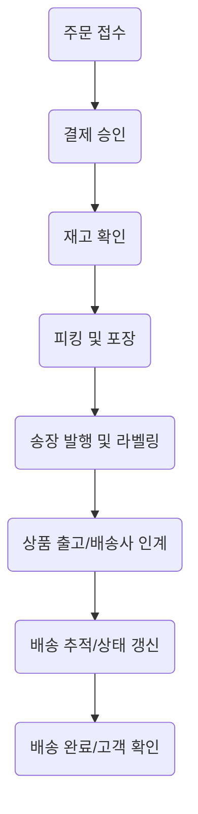

```markdown
<!-- reveal.js markdown presentation start -->

# 고객 배송 컴플레인 및 CS 프로세스 혁신 방안  
#### (배송 일정 안내, 데이터/개인정보 관리, 할인&보상 프로세스)
<br>
**발표자:** 안치윤 <br>
**부서/직급:** 인사팀, 사원 <br>
**이메일:** ahntest@gmail.com  
**작성일:** 2024-06

---

## 목차

1. 고객 주요 요구사항 & 현황 진단  
2. 표준 배송 프로세스 및 지연 이슈  
3. 데이터·개인정보 관리 구조  
4. 실시간 일정안내&자동화 방안  
5. 추가 할인 및 고객 만족 전략  
6. 통합 솔루션&실무 가이드  
7. 결론 및 향후 제언  

---

# 1. 고객 요구사항 요약 및 현황

---

## 배송 지연 해소 요청

- 명확한 일정 안내 없이 반복적 배송 지연
- 출하~배송 대기, 위치 추적 불분명  
- "내 주문 어디쯤/언제 도착?" 반복 문의  
- 공급망·택배사 이슈로 명확한 일정 안내 곤란  
- 거래처·협력사별 상황 차이 커 매뉴얼 필요

---

## 실무 적용 예시

- "5월 22일 밤 10시경 출발, 분류 대기 중, 25일 예정"
- 전국적 물류 지연시, 사전 알림 & 사과문 안내  
- 우선 안내, 추가 알림, 보상 쿠폰 등 차별화 대응

---

## 정확한 일정 안내: 고객 구체 요구

- 실시간 혹은 정기적 ‘정확한’ 예정일 안내  
- 변동 시 고객이 먼저 알 수 있게 능동적 커뮤니케이션  
- 예: "오늘 발송 여부/도착 예정/지연 알림을 자동 수신"

---

### 실무 쟁점 및 적용문구

- ERP·WMS 데이터 연동 필수, 상담 전 proactive한 알림 체계 구축 필요
- 알림 메시지 표준화 중요(정보 미동기·오정보시 환불↑)  
- “5/24 오후 8시 인계 예정, 변동시 즉시 안내”

---

## 주문/이전 내역 확인 요구

- ‘이전 구매/누락/적립금’ 등 확인요구 다발
- 통화/상담 중 과거 주문 이중 확인 증가  
- 주문 병합/취소/변경시 이중 문의 클레임↑  

---

### 실무 쟁점
- CS-주문 시스템간 데이터 싱크오류(취소 누락 등) 위험  
- 개인정보법 준수하며 제공범위, 처리절차 매뉴얼 필요

---

# 2. 표준 배송 프로세스 및 주요 이슈

---

## 표준 배송 흐름도


---

## 단계별 주요 이슈 & 사례

- **주문/결제:** 시스템 장애시 0.2~0.5% 지연(실제 3,500건/대형A사)
- **재고확인:** API 연동/오차로 월 배송지연의 38%가 원인
- **피킹/포장:** 수동 오류, 병목. (쿠팡 자동화 오류→2시간 지연)
- **송장/라벨:** 연동 장애로 9% 배송 민원
- **출고/배송사 인계:** 택배차량 지연, 권역별 연착(연간 불만 26~31%)
- **배송 추적:** 상태미갱신시 클레임 4배, 상담비 1.5~2배 증가
- **배송완료/확인:** 오배송/미배송 시 클레임·소비자 불만↑

---

## 배송 지연의 주요 원인 (심층)

---

### 물류·운송 병목

- 피킹·포장 수작업, 차량 집중운행 → 이벤트시 생산성 40%↓  
- **개선:** 자동화, 집화 시간 분산  
---
### 시스템·정보 연동 오류

- ERP/OMS/WMS/API 불안정 → 수많은 이슈(13,000건/4시간 지연)  
- **개선:** 실시간 동기화툴, 장애자동알림체계  
---
### 커뮤니케이션 결여

- 안내 미발송, FAQ 미정비, FAQ 내용 불일치  
- **실제:** 미공지시 고객평가 15%↓, CS운영비 2배↑

---

## 일정 안내 & 공지 미흡의 실제 사례

- 자동 알림률 업계 평균 60~78% 불과  
- 행사/특가시 20% 안내 미실시(쿠팡 미발송률 24%)
- 배송지 변경 미반영, 등급별/채널별 미구분 안내 다수

---

# 3. 데이터·개인정보 관리 구조

---

## 고객 요청 정보 관리: 핵심 구조도

```mermaid
flowchart LR
    A[고객 요청 · 주문] --> B[데이터 수집/입력계]
    B --> C[중앙 CRM 서버]
    C --API 통신--> D[물류/배송 연계 시스템]
    C -. 암호화.-> F[데이터 저장소(암호화 처리)]
    C <--> E[자동화 처리/워크플로우 엔진]
    F --BI 분석--> G[데이터 인사이트/리포트]
    C <..> H[관리자/상담원 대시보드]
```

---

## 개인정보 보안 및 접근 관리

- 입력/저장 구간별 **암호화**(TLS, AES-256)
- **PII 분리저장, 마스킹/해싱 처리**
- **RBAC**: 접근권한 최소화, 행위 로그 전체 저장  
- **익명/가명화**: 분석/테스트 시 실제 정보 차단  
- **실시간 위협알림, 보안점검, 침투테스트 정기화**

---

## 실무 예시 & 절차

- 상담원은 역할별 데이터 접근만 가능  
- 모든 개인정보 조회 로그 저장 및 통제  
- 자동화 워크플로우로 중복/오류 필터, AI 기반 이상 탐지

---

# 4. 실시간 일정 안내·자동화 시스템

---

## 실시간 일정안내 시스템 구축

- **TMS·OMS 연동, 배송기사·차량·경로 자동배정**
- 단계별 상태 자동 갱신 & 고객 실시간 안내  
- **고객포털**: 위치·예상시간 조회

---

### 국내외 모범사례

- **CJ대한통운:** 기사위치, 분류장→집하→배송중 단계 실시간 안내  
- **FedEx:** 고객이 예상도착 시간, 경로변경 등 직접 제어 가능

---

## 단계별 워크플로우

1. OMS/CRM 주문 생성
2. 배송 자원 자동 배정/일정 산정
3. 최초 안내(카톡/SMS/앱 등)
4. 상태/ETA 실시간 갱신
5. 예외 발생시 자동 안내 + CS 연결
6. 완료시 최종 피드백/알림

---

## 주요 체크리스트

- OMS–TMS–CRM 연동 여부
- 상태값 트리거별 실시간 동기화
- 예외(지연/취소) 발생시 수동+자동 안내 체계

---

# 5. 추가 할인 및 고객 만족 제고 전략

---

## 추가 할인/보상 적용의 기본 원칙

- **불편경험, 일정금액, 장바구니 이탈 등 데이터 기반 타깃**
- 이벤트/멤버십/리뷰참여 등 상황별 차등 적용
- **직접할인/무료배송/적립금·바우처 등 복합 지원**
- **CS협업, 자동이관, 모니터링 대시보드**

---

## 할인 적용 단계/워크플로우

| 단계 | 주요 절차 | 시스템/부서 | 체크포인트 |
|---|---|---|---|
|이슈 접수|CS/챗봇/웹폼|즉시|자동화|
|대상 선별|CRM/마케팅|2~6시간|데이터 매칭|
|쿠폰 발급|ERP–CRM|3시간|1회성/기한|
|고객안내|SMS,푸시 등|즉시|개인화|
|사후모니터|대시보드|24시간~|사용·응답 추적|

---

## 고객 만족도 피드백/리뷰 시스템

- 설문, 챗팅, 리뷰 등 다채널 피드백
- 불만족 고객 즉시 CS 우선배정/2차 혜택
- AI 기반 리뷰 분석, KPI 대시보드로 효과 실시간 측정

---

## 성공적 마케팅·CS 연동 사례

- **시즌 한정 할인**: 정가판매율 78%→매출↑  
- **멤버십 할인**: 회원구매율 62%↑  
- **CS 콜라보 쿠폰**: 재구매율 19%P↑, 불만 접수↓  
- **SNS 챌린지**: 리뷰, SNS 연계 참여율 확대

---

# 6. 통합 솔루션 및 실무 가이드

---

## 혁신 솔루션 요약

- **클레임, 불만 유형 자동화/데이터화**
- **실시간 송장 안내/프로액티브 알림**
- **CS 표준 스크립트/매뉴얼 구축**
- **부서간 모듈 협업 플랫폼**
- **고객 DB/이력·보상 관리 자동화**

---

## 실무 임팩트 / KPI 변화

| 항목            | KPI 정의               | 6개월 기대효과       |
|----------------|---------------------|-------------------|
|할인 응답률     |발급대비 사용률           |20~35%↑           |
|CS 만족도       |4점(5점만점) 이상          |75%→90%           |
|재구매율        |2회 이상 구매             |13%→25%           |
|이탈률 감소     |미재방문 비율             |8%P↓              |
|평균 객단가     |할인가 적용 평균구매액      |10~17%↑           |
|VOC 클레임↓     |불만/클레임 접수 감소      |20~40%↓           |

---

## 실무 가이드 & 체크리스트

- **실시간 배송상태/지연 등 자동화 관리**
- **개인정보·법규준수(보관, 동의, 목적 명시 등)**
- **AI 챗봇-상담사 2단계 대응체계**
- **Scalable API 및 데이터 연동 표준화**
- **부서간 커뮤니케이션 & 교육 수립**
- **성공/실패사례 정기 공유 및 개선**

---

# 결론 및 향후 제언

---

## 결론

- **복합적 병목(연동/자동화/커뮤니케이션) 해소가 핵심**
- **‘실시간 안내–표준 스크립트–DB일원화’** 동시 강화 필요
- **자동화·AI·워크플로우 기반 데이터 혁신 필수**
- **지속적 교육, 협업 플랫폼, KPI 기반 개선활동이 실효성 보장**

---

## 향후 액션 플랜

- **월단위 정기 교육 및 아이디어 리뷰 회의**  
- **모바일 대시보드/이슈 트래커 실시간화**  
- **AI 기반 이슈 자동 분류·우선순위화 순차 도입**  
- **법규, 보안, 내부 통제사항 정기 검토/업데이트**

---

# Q&A  
<br>
**감사합니다.**  
발표자 : 안치윤(인사팀)  
ahntest@gmail.com  

<!-- reveal.js markdown presentation end -->
```