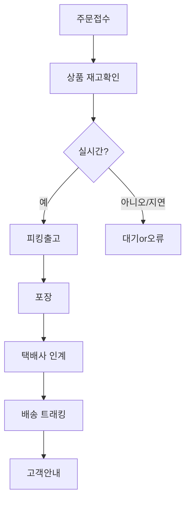

```markdown
---
## 🚚 고객 경험 혁신을 위한<br>배송/주문/CS 프로세스 개선 전략
#### 발표자: 안치윤 (인사팀 사원)
#### 이메일: ahntest@gmail.com
#### 2024년 作 / [작업 완료 - 날짜 TBD]
---

## 목차
1. 고객 요청 배경 및 문제 현황
2. 프로세스별 병목 이슈 진단
3. 구조적/시스템 개선방안 제안
4. 실무 커뮤니케이션 및 CS 매뉴얼
5. 주문 내역/할인 관리 개선
6. 결론 및 실행 전략

---

## 1. 고객 요청 배경 및<br>배송 문제 현황

- 최근 **배송 지연**이 빈번히 발생, 고객 불만 심화
- 신속 배송/정확한 일정 안내/할인혜택 문의 증가
- 고객 경험 저하 → 기업 신뢰도·재구매율 하락

---
### 주요 이슈 (고객 관점)
- **배송 지연 빈발:** 약속된 익일→실제 3일+ 소요, 고객 불만 표출, 반복 CS 문의 유발
- **정확한 일정 안내 부족:** 사전 안내 부정확, 실시간 정보 제공 미흡, 고객 예측 어려움
- **주문 내역 확인 불편:** UI/UX 미흡, 복수 주문/분할배송 내역 확인 어려움
- **할인/쿠폰 적용 문의 급증:** 지연/불만 발생 시 추가 보상 요구, 절차 불투명성

--

### 실제 현장 사례 분석

- 사례: 2024.4.18 고객A 주문, 익일배송 약속→3영업일 지연(22일 도착)
- 3개월간 익일배송 9.7% 지연, 이 중 37% 정보 안내/내부 처리 문제
- 배송상태 안내 오류, 고객 문의 반복, 보상 없음

---

## 2. 프로세스 단계별<br>병목 이슈 진단

### 주문접수~배송~CS 흐름 및 주요 병목



---

### 단계별 상세 문제

- **주문-재고 연동 지체:** 동시 주문 급증 시 처리속도 한계, 결제 후 ‘재고 부족’ 지연 안내 발생
- **출고(피킹/티켓) 오류:** 자동화 프로세스 중복/누락, 재작업 발생 → 전체 출고 대기시간 증가
- **물류 이송 병목:** 인계지연/예외 미처리, 택배사 커뮤니케이션 부재
- **배송 트래킹/CS 부실:** 배송상태 실시간 갱신 오류(≥70%), 동일 건 반복 CS, 고객 이탈
- **예측·자동화 시스템 미흡:** End-to-End 트래킹, 패턴분석 및 사전 경보 미구현

---

## 3. 구조적/시스템 개선 방안

### 핵심 개선 프레임워크

- **1. 실시간 프로세스 연동 최적화**
    - OMS–WMS–ERP간 Sync 정확성/속도 강화
    - 동시 주문량 예측 AI 적용

- **2. 자동화/예외 프로세스 고도화**
    - 피킹오더 중복/누락 방지, 대시보드 모니터링
    - 예외/오류 알람 및 즉시조치 매뉴얼 구축

- **3. 실시간 배송 트래킹·고객 알림**
    - 배송단계별 상태값 자동 동기화 & 실시간 멀티채널 안내
    - ETA/배송기사/위치 정보 앱/문자/카톡 안내

--

### 시스템/운영기능별 개선안

| 개선 항목                             | 도입전(기존)                | 개선후(신속배송)               |
|--------------------------------------|---------------------------|---------------------------|
| 출고관리                            | 수기/반자동                 | 전체 100% API 연동          |
| 배송예상 시간                        | 고정/일괄 안내               | 맞춤 ETA, 위치 트래킹 반영   |
| 고객 안내                            | 단방향 문자/이메일           | 앱·알림톡·CS 동시 멀티채널    |
| 지연·클레임 처리                     | 수동·누락 빈발               | 자동 감지·초단위 대응         |
| 업무 효율                            | 엑셀/수기 보고               | 대시보드 실시간 시각화        |
| 고객 만족도                          | 60~70점                    | 90점+ (문의감소/재구매↑)      |

---

## 4. 실무 커뮤니케이션<br>및 CS 대응 매뉴얼

### 단계별 고객 안내 시나리오

- **1. 주문접수 직후:**  
    - "[고객명], 주문이 정상 접수. 도착예정일: [날짜]. 실시간 트래킹 링크 제공"
- **2. 출고/배송 준비:**  
    - "주문상품 출고 준비중, 다음 절차/예정시간 안내"
- **3. 배송중-예상 도착:**  
    - "물류센터 출발/배송중, 기사 전화·ETA 안내, 위치 확인"
- **4. 배송완료/피드백:**  
    - "안전 배송완료, 불편 시 1:1문의, 만족도 조사 요청"

--

#### 이슈(지연/파손/분실) 발생 시

- **즉각 사과+예정일 리마인드:**  
    - "예기치 못한 사유로 1일 지연, 불편 보상 쿠폰 지급"
- **심각 클레임:**  
    - "파손/분실 즉시 담당자 연락, 재배송 일정/보상안 설명"

--

### 적시·정확성 체크리스트

- [x] 실시간 정보/링크 항상 포함
- [x] 단계별 안내문·알림 자동화/표준화
- [x] CS, 물류, IT 실무자 역할 구분
- [x] 이슈 30분 내 우선 안내/12시간 내 대안 제공

---

## 5. 고객 주문 내역/할인관리<br>시스템 혁신

### 투명한 주문 내역 확인 프로세스

- **원본 데이터 ERP/웹 연동 추출**
- **식별자/상태코드 등 이중 검증**
- **이력 상세기록(할인, 변경, 환불) 투명 제공**
- **고객 MyPage/다운로드/내역 열람 기능 강화**

--

### 할인 적용 실무 프로세스

| 구분         | 적용 기준                   | 프로세스                    |
|------------|--------------------------|--------------------------|
| 정기 프로모션  | 기획/이벤트                   | 시스템 자동 적용             |
| 등급별/우수고객 | 재구매/등급별                   | 등급 DB 연동 자동 쿠폰           |
| CS 보상      | 지연/오배송 등                  | 담당자 요청/정책기록, 내부 승인 |
| 중복 방지     | 이중 사용 제한                  | 쿠폰별 Flag, 승인지정          |

- **모든 할인/보상내역 이력 및 설명·승인체계 자동기록**
- **월 1회 이상 이력/정합성 감사, 원클릭 내역 열람**

---

## 6. 결론 및 실행 전략

### 결론 요약

- **1. 고객 경험 혁신 우선:**  
    - 지연 방지→실시간 안내→투명한 내역·할인 관리가 신뢰도 핵심
- **2. 자동화·예측·AI 기반 운영:**  
    - 실시간 트래킹/알림/사전 보상 프로세스로 NPS, 재구매율 비약적 개선
- **3. 체계적 커뮤니케이션&CS 개선:**  
    - 단계별 시나리오, 실무매뉴얼로 문의 감소·축적 신뢰도 증가
- **4. 데이터 기반 맞춤 관리/혜택:**  
    - 주문 히스토리·쿠폰 자동화, 반복 문의↓·충성도↑

--

### 실행 방안 한눈에

- 실시간 배송 ETA 시스템, 중요 내역 멀티채널 안내 즉시 도입
- 자동 보상 정책/FAQ/문의 응대 AUTO 도입 (챗봇/알림톡)
- 관리자 대시보드 통한 End-to-End 트래킹 및 품질지표 실시간 시각화
- 월별/분기 감사 및 KPI 트래킹, 고객 피드백/이슈 즉시 개선 루프
- 3년+ 장기고객 성장 및 브랜드 신뢰지수 상승 포커스

---

## Q & A

*감사합니다*
> 발표자: **안치윤 (인사팀 사원)**
> 문의: ahntest@gmail.com

---
```